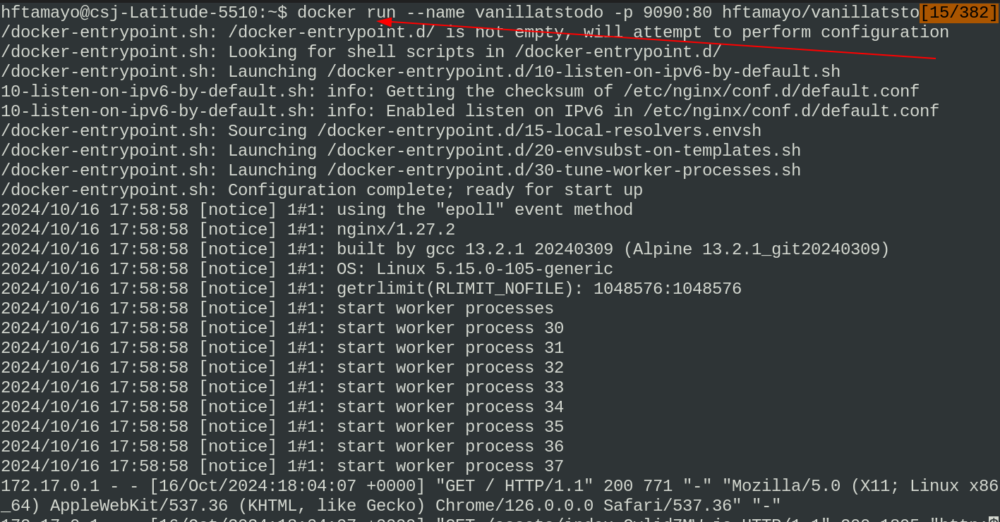
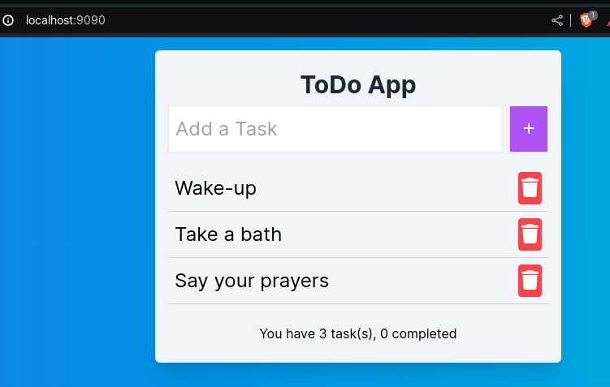

# TODO LIST APPLICATION

## Summary:

- **Helm Chart**: Located in `devops/helm-chart-app/` for application templating
- **Kustomize**: Located in `devops/kustomize-app/` for environment-specific configurations
- **GitOps Ready**: Designed for ArgoCD and modern GitOps workflows

### Deployment Options:

#### 1. Using Kustomize + Helm (Recommended)

````bash
# Deploy to experimental environment
kubectl apply -k devops/kustomize-app/overlays/experimental

# Deploy to staging environment
kubectl apply -k devops/kustomize-app/overlays/staging

# Deploy to production environment
kubectl apply -k devops/kustomize-app/overlays/productionsic application written in Vanilla Typescript, the objective is to put in practice knowledge of Typescript's structures and DOM's event management.

This application is a good starting point to a React.JS based version to extend it putting in practice concepts like:

1. Clean code
2. SOLID principles
3. Introducing state management.

## How to run the project:

### Bare metal:

1. Clone this repo
2. yarn run dev
3. Open your browser and type this URI: http://localhost:5173


### Using docker image:

1. Clone this repo
2. Open the Dockerfile and follow the instuctions at the end
3. after spinning up the container open your browser and type this URI: http://localhost:9090





## Kubernetes Deployment:

This application is ready for production deployment using a GitOps-ready Kustomize + Helm architecture:

### Architecture Overview:

- **Helm Chart**: Located in `devops/helm-chart-app/` for application templating
- **Kustomize**: Located in `devops/kustomize-app/` for environment-specific configurations
- **GitOps Ready**: Designed for ArgoCD and modern GitOps workflows

### Deployment Options:

#### 1. Using Kustomize + Helm (Recommended)

```bash
# Deploy to experimental environment
kubectl apply -k devops/kustomize-app/overlays/experimental

# Deploy to staging environment
kubectl apply -k devops/kustomize-app/overlays/staging

# Deploy to production environment
kubectl apply -k devops/kustomize-app/overlays/production
````

#### 2. CI/CD Pipeline

GitHub Actions workflows automatically deploy using Kustomize when code is pushed to specific branches.

### Infrastructure as Code:

- **Terraform**: Complete AWS EKS infrastructure in `devops/terraform/`
- **Monitoring**: Comprehensive observability setup with Prometheus and Grafana
- **Security**: Production-ready security configurations and best practices

For detailed deployment instructions, see `devops/helm-chart-app/README.md`
