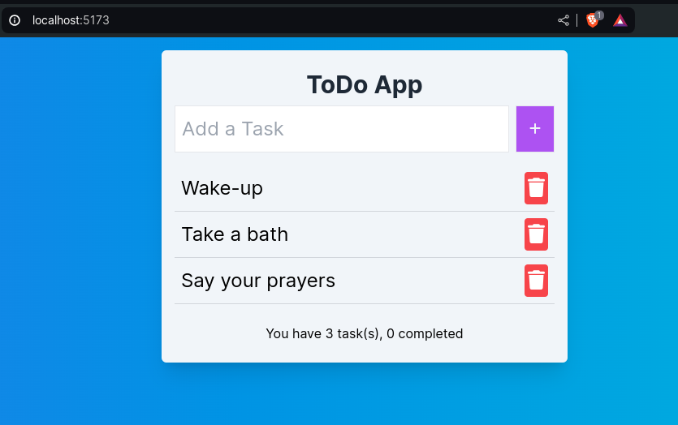

# TODO LIST APPLICATION

## Summary:

This is a very basic application written in Vanilla Typescript, the objective is to put in practice knowledge of Typescript's structures and DOM's event management.

This application is a good starting point to a React.JS based version to extend it putting in practice concepts like:

1. Clean code
2. SOLID principles
3. Introducing state management.

## How to run the project:

### Bare metal:

1. Clone this repo
2. npm run dev
3. Open your browser and type this URI: http://localhost:5173

### Using docker image:
